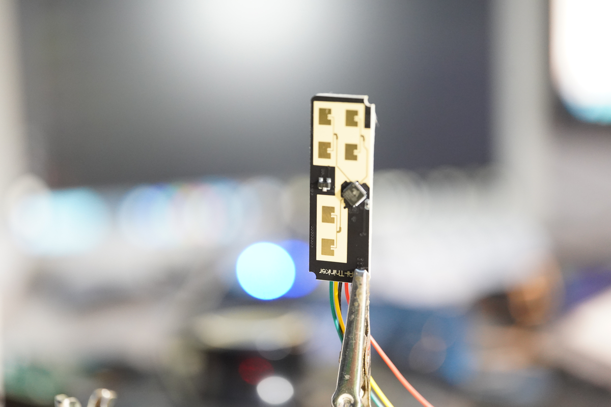

# RD-03D Radar
This is a small python script for interfacing with RD-03D radar devices via a USB to serial adapter. Provides "real-time" target tracking with optional visualization in polar coordinates.



## Features
- Serial communication with RD03 radar devices
- Real-time parsing of target data including position, speed, and distance
- Live visualization of targets with motion trails
- Support for tracking up to 3 simultaneous targets

## Installation
```bash
python -m venv .venv
activate .venv/bin/activate
pip install serial matplotlib numpy
```

## Using it in a secondary script
```python
from rd03_protocol import RD03Protocol

# Initialize with visualization enabled
radar = RD03Protocol("/dev/ttyUSB0", enable_plot=True)

try:
    while True:
        targets = radar.read_frame()
        for target in targets:
            print(f"Target at ({target.x_coord}, {target.y_coord}), Speed: {target.speed}")
finally:
    radar.close()
```

## Protocol Specifications
The specifications are taken from [here](https://docs.ai-thinker.com/_media/rd-03d_multi-target_trajectory_tracking_user_manual.pdf)
- Baud Rate: 256000
- Frame Format: Header (0xAA, 0xFF, 0x03, 0x00) + Target Data + Footer (0x55, 0xCC)
- Target Data: 8 bytes per target (x, y coordinates, speed, distance)

It is hilarious, that this section is found right in front of the communication protocol section:
> The Rd-03D is designed for high-precision multi-target recognition millimeter-wave sensors and is not recommended for secondary development; if the user insists on development, refer to this chapter and Chapter 6.